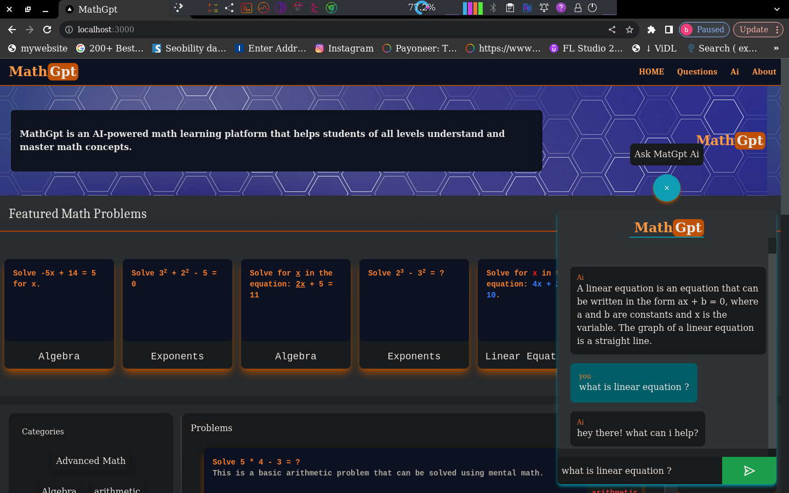
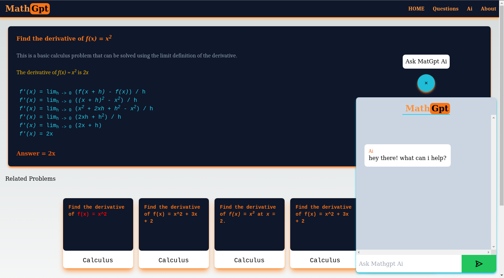
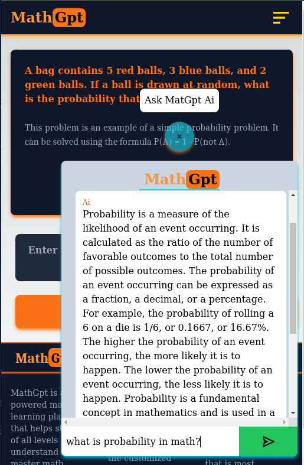
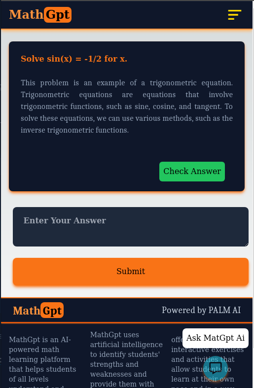
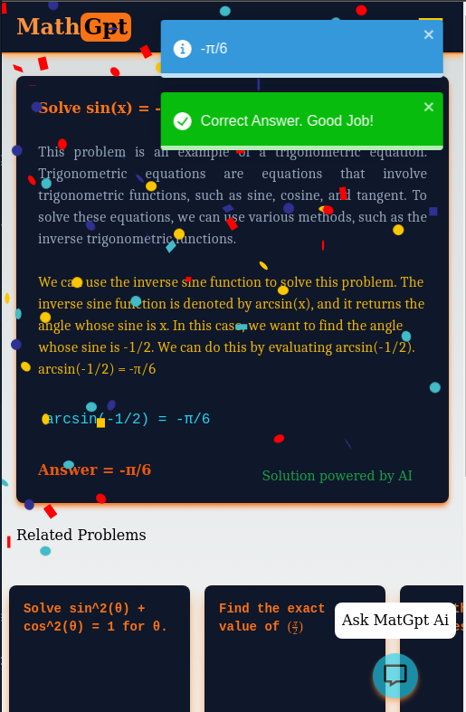

# MathGpt

### Web app For practicing and learning Math With AI

MathGpt is A web allplication for solving and practising Math problems and fully powered by ai
Math Problems are generated and explaned by the AI
```
The Ai Will Generate 
 - a math problem to solve 
 - explanation about the problem of the idea and how to solve it
 - a correction on users answer
 - Note about the factors and category of the question
  i.e:
  Note About Algebra

 - and answer any question user asks the ai model through the pltform. 
  
```

  

<p align=""center>
  



# Math Problem with Ai

</p>

# author 
`Biruk Yonas (bukapitch)`
